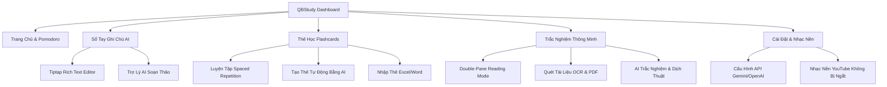

# 🚀 QBStudy - Ứng Dụng Học Tập Thông Minh Tích Hợp AI

**QBStudy** là một nền tảng học tập cá nhân hóa hiện đại, được xây dựng trên nền tảng **React + Vite** kết hợp cùng **Firebase** và công nghệ trí tuệ nhân tạo (AI). Ứng dụng tích hợp đầy đủ công cụ cần thiết cho một học viên thời đại số: ghi chú nâng cao, thẻ từ vựng (flashcards), ôn thi trắc nghiệm thông minh, đồng hồ Pomodoro tập trung và nhạc nền học tập chuyên sâu (Deep Work).

---

## 📸 Giao Diện Đẹp Mắt & Premium
Ứng dụng được thiết kế theo phong cách hiện đại với giao diện **Glassmorphism**, hiệu ứng chuyển động mượt mà, hỗ trợ **Dark Mode** tự động và cách phối màu hài hòa (Violet & Cyan) tạo cảm hứng học tập tối đa.



---

## ✨ Các Tính Năng Nổi Bật

### 1. 📅 Trang Chủ & Quản Lý Tập Trung (Home & Pomodoro)
*   **Hướng dẫn sử dụng nhanh:** Giúp người mới bắt đầu làm quen với ghi chú, flashcards, quizzes và theo dõi tiến độ.
*   **Đồng hồ Pomodoro:** Quản lý thời gian học tập theo chu kỳ 25 phút tập trung (Focus) và 5 phút nghỉ ngơi (Break) kèm theo vòng tiến độ trực quan, âm báo bật/tắt tiện dụng.
*   **Luyện Đọc Tin Tiếng Anh Hằng Ngày:** Tích hợp nguồn đọc uy tín (VOA Learning English, BBC Learning English) chia theo cấp độ giúp người học cải thiện tiếng Anh mỗi ngày.
*   **Theo Dõi Tiến Trình (Study Stats):** Hệ thống tích lũy chuỗi ngày học tập (**Streak**) và biểu đồ phần trăm hoàn thành mục tiêu ngày tự động.

### 2. 🎵 Nhạc Nền Deep Work Không Gián Đoạn
*   Tích hợp trình phát nhạc YouTube chạy ẩn dưới nền hệ thống.
*   Nhạc nền được giữ nguyên trạng thái phát, không bị ngắt quãng khi bạn chuyển đổi qua lại giữa các màn hình (Notes, Flashcards, Quizzes).
*   Tính năng tăng âm lượng từ từ (**Fade-in**) khi bắt đầu giúp người học tập trung sâu mà không bị giật mình.
*   Tự chọn danh sách phát hoặc đường dẫn YouTube yêu thích của riêng bạn trong phần cài đặt.

### 3. 📝 Sổ Tay Ghi Chú Thông Minh (Smart Notebook)
*   **Giao diện Grid thời thượng:** Tự động áp dụng các dải màu gradient sang trọng cho từng thẻ ghi chú, hỗ trợ lọc thẻ theo nhãn dán (**Tags**) và thanh tìm kiếm nhanh.
*   **Trình Soạn Thảo Tiptap Cao Cấp:**
    *   Hỗ trợ đầy đủ định dạng văn bản (In đậm, nghiêng, gạch chân, gạch ngang, highlighter, căn lề, khoảng cách dòng).
    *   Chèn liên kết, bảng biểu trực quan và kẻ ngang.
    *   **Kéo thả & Thay đổi kích thước ảnh trực tiếp:** Hỗ trợ dán ảnh trực tiếp từ clipboard và kéo thả các góc để chỉnh kích cỡ ảnh ngay trên trình biên soạn.
    *   Hỗ trợ danh sách công việc dạng checklist (**Task list**).
*   **Trợ Lý AI Đồng Hành:**
    *   *AI Dàn Ý:* Sinh tự động cấu trúc bài học chi tiết dựa trên Tiêu đề ghi chú.
    *   *AI Viết Tiếp:* Tự động viết tiếp ý tưởng học tập tiếp theo.
    *   *AI Xử Lý Đoạn:* Giải thích ngắn gọn, tóm tắt, viết lại văn bản chuyên nghiệp, lấy ví dụ thực tế hoặc dịch thuật nhanh đoạn bôi đen.

### 4. 🗂️ Thẻ Ghi Nhớ (Flashcards System)
*   Phân chia từ vựng theo từng **Decks** (Bộ thẻ) riêng biệt.
*   **Chế Độ Luyện Tập (Study Mode):** Hiệu ứng lật thẻ 3D mượt mà kèm đánh giá mức độ ghi nhớ: *Chưa nhớ* ❌, *Tạm nhớ* ⚠️, *Đã thuộc*  để tối ưu hóa lộ trình ôn tập.
*   **Sinh Thẻ Hàng Loạt Bằng AI:** Nhập danh sách từ tiếng Anh cần học, AI sẽ tự động điền đầy đủ: *Phát âm IPA, Loại từ, Nghĩa tiếng Việt, Câu ví dụ, Từ đồng nghĩa*.
*   **Nhập Thẻ Tiện Lợi (Import):** Sao chép trực tiếp từ bảng tính Excel hoặc Word và dán vào ứng dụng, tự chọn ký tự ngăn cách thông minh.

### 5. 📝 Trắc Nghiệm Thông Minh & Ôn Thi (Smart Quizzes)
*   Phân loại đề trắc nghiệm theo **Thư mục (Folders)** khoa học.
*   **Hỗ trợ đa dạng phương thức nhập đề:**
    *   Nhập văn bản thuần.
    *   **Quét ảnh bằng OCR (Tesseract.js):** Chụp ảnh đề thi và tải lên, ứng dụng sẽ quét và trích xuất chữ tự động.
    *   **Tải lên tệp PDF & Word (.docx):** Đọc nội dung trực tiếp để tạo bộ trắc nghiệm.
*   **Tạo đề thi bằng AI:** Chỉ cần cung cấp chủ đề hoặc tài liệu, AI sẽ tự tạo bộ câu hỏi trắc nghiệm kèm giải thích chi tiết.
*   **Chế độ Đọc Hiểu (Double-Pane Reading Mode):** Chia đôi màn hình cực đỉnh giúp hiển thị đoạn văn đọc hiểu bên trái và danh sách câu hỏi bên phải, tránh mỏi mắt vì cuộn trang liên tục.
*   **Chế độ Thi Thử (Self-Test):** Ẩn hoàn toàn đáp án và giải thích, chấm điểm tự động, thống kê các lỗi sai trực quan sau khi nộp bài.
*   **Xuất File Word chuyên nghiệp:** Xuất đề thi đã soạn thảo thành file `.docx` định dạng chuẩn để in ấn hoặc chia sẻ.
*   **Menu Dịch Thuật & Lưu Thẻ AI:** Bôi đen bất kỳ từ nào trong đề thi, popup AI sẽ hiển thị giúp:
    *   Dịch nhanh từ vựng.
    *   Phát âm từ (Text-to-Speech).
    *   **Lưu trực tiếp vào Flashcard:** Một nút nhấn để biến từ vừa tra thành thẻ học mà không cần gõ tay.

---

## 🛠️ Công Nghệ Sử Dụng (Technology Stack)

*   **Frontend Library:** React (phiên bản 19)
*   **Build Tool:** Vite
*   **Styling:** Tailwind CSS + Custom CSS (Glassmorphism & Neon Glow)
*   **Database & Auth:** Firebase Firestore & Firebase Authentication (Google & Email/Password)
*   **Rich Editor:** `@tiptap/react` & `@tiptap/starter-kit` (cùng các extension Tables, Images, TaskLists...)
*   **AI Integration:** Google Gemini API (`gemini-1.5-flash-latest`) & OpenAI API (`gpt-4o-mini`)
*   **Document Parsers & Generators:**
    *   `pdfjs-dist`: Đọc tài liệu PDF.
    *   `tesseract.js`: Nhận dạng ký tự quang học (OCR) từ hình ảnh.
    *   `mammoth`: Đọc cấu trúc tài liệu Word.
    *   `docx` & `file-saver`: Xuất bản tài liệu Word chuẩn hóa.
*   **Orther libraries:** `react-joyride` (hướng dẫn người dùng), `uuid`, `lucide-react`.

---

## 💻 Hướng Dẫn Cài Đặt và Chạy Local

### 📋 Yêu Cầu Hệ Thống
*   Đã cài đặt **Node.js** (Khuyến nghị phiên bản LTS mới nhất).
*   Một tài khoản **Firebase** để cấu hình Database và Auth.

### 📥 Các Bước Thực Hiện

1.  **Clone mã nguồn dự án:**
    ```bash
    git clone https://github.com/quocbaooooo/QBstudyapp.git
    cd QBstudyapp
    ```

2.  **Cài đặt các thư viện phụ thuộc:**
    ```bash
    npm install
    ```

3.  **Cấu hình Firebase:**
    Các thông số Firebase đã được cấu hình sẵn trong tệp `src/firebase.js`. Nếu bạn muốn sử dụng Database của riêng mình, hãy thay đổi cấu hình `firebaseConfig` trong file [firebase.js](file:///d:/vibecoding/study-app/src/firebase.js):
    ```javascript
    const firebaseConfig = {
      apiKey: "YOUR_API_KEY",
      authDomain: "YOUR_AUTH_DOMAIN",
      projectId: "YOUR_PROJECT_ID",
      storageBucket: "YOUR_STORAGE_BUCKET",
      messagingSenderId: "YOUR_MESSAGING_SENDER_ID",
      appId: "YOUR_APP_ID"
    };
    ```

4.  **Chạy dự án ở môi trường phát triển (Local Development):**
    ```bash
    npm run dev
    ```
    Ứng dụng sẽ chạy tại địa chỉ mặc định: [http://localhost:5173](http://localhost:5173).

5.  **Xây dựng bản Product đóng gói (Build):**
    ```bash
    npm run build
    ```

---

## 🗝️ Cấu Hình API Key Trí Tuệ Nhân Tạo (AI)
Để bảo mật tuyệt đối thông tin, ứng dụng không lưu trữ API Key trên máy chủ. Bạn hãy tự nhập API Key cá nhân của mình trong tab **Cài đặt** của ứng dụng:
*   Hỗ trợ khóa **Gemini API** miễn phí từ Google AI Studio.
*   Hỗ trợ khóa **OpenAI API** của ChatGPT.
*   Dữ liệu khóa được lưu trữ an toàn trong **LocalStorage** trên trình duyệt của riêng bạn và chỉ gửi trực tiếp lên API của nhà cung cấp.

---

## 📂 Cấu Trúc Thư Mục Dự Án
```text
study-app/
├── public/                 # Ảnh logo, favicon và tài nguyên tĩnh
├── src/
│   ├── assets/             # Hình ảnh và font assets
│   ├── components/         # Các Component giao diện (Home, Notes, Decks, Quizzes...)
│   ├── contexts/           # Quản lý State chung (Xác thực người dùng AuthContext)
│   ├── hooks/              # Custom Hooks (useFirestore, useLocalStorage, usePomodoro...)
│   ├── utils/              # Các hàm tiện ích (Xuất file Word, định dạng thời gian)
│   ├── firebase.js         # Khởi tạo kết nối Firebase
│   ├── index.css           # Cấu hình Style và biến màu chủ đạo
│   ├── App.jsx             # Điểm điều hướng chính của ứng dụng
│   └── main.jsx            # Điểm khởi động chính của React
├── index.html              # HTML template chính tích hợp cấu hình Tailwind CSS
├── package.json            # Danh sách thư viện sử dụng và kịch bản lệnh
└── vite.config.js          # Cấu hình công cụ đóng gói Vite
```

---

## 📝 Giấy Phép & Đóng Góp
Dự án được phát triển nhằm mục đích nâng cao hiệu quả tự học. Mọi đóng góp, cải tiến mã nguồn thông qua **Pull Request** hoặc báo lỗi qua **Issues** đều được chào đón!

*   **Tác giả:** Quốc Bảo (quocbaooooo)
*   **Trạng thái:** Hoạt động & Phát triển tính năng mới.

---
⭐ *Hãy tặng dự án 1 sao nếu bạn thấy nó hữu ích cho quá trình học tập của mình nhé!*
